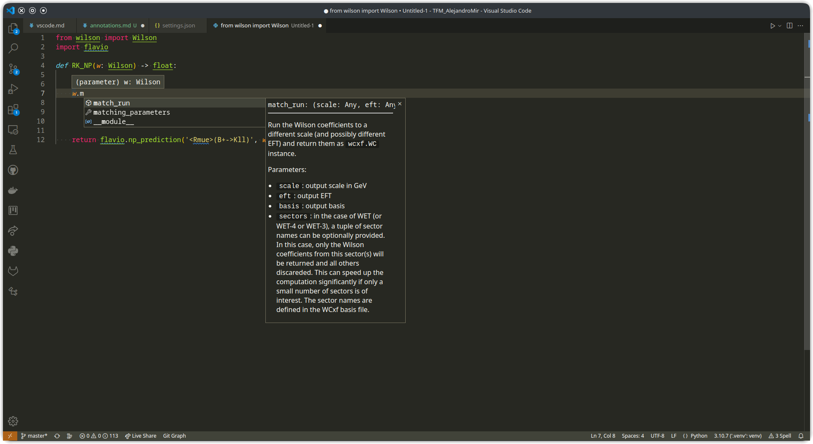
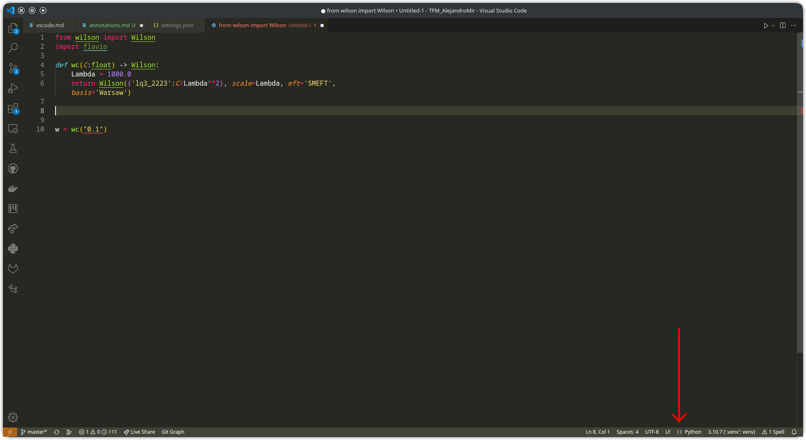
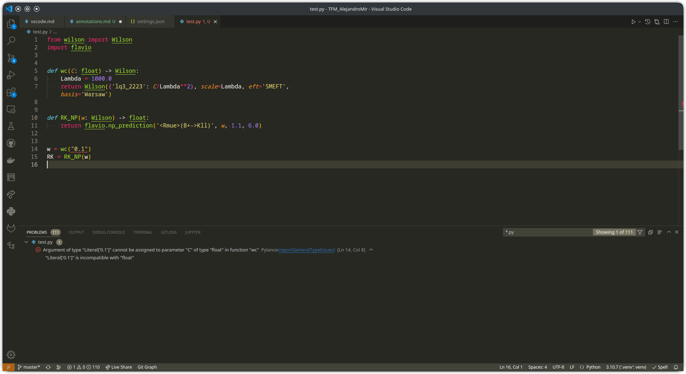
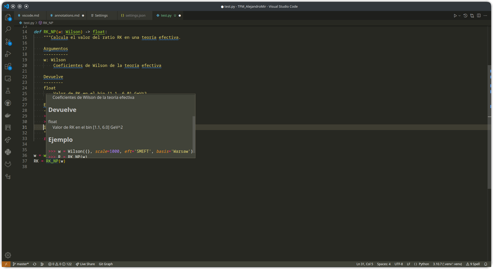

# Anotaciones de tipos y docstrings

## Anotaciones de tipos

En algunos lenguajes de programación, como es el caso de C/C++, es necesario especificar el tipo de una variable al usarla por primera vez (declarar):

```C
void main(){
    int x = 5;
}
```

Por el contrario, en Python no se declara el tipo de las variables, sino que el intérprete es capaz de inferirlo. Esto puede suponer algunas ventajas en la comodidad de escribir código, pero también tiene sus inconvenientes:

* **Optimización:** Uno de los motivos por los que Python es más lento que otros lenguajes es precisamente el hecho de que el intérprete tenga que averiguar el tipo de las variables. Es posible mitigarlo en cierta medida, usando código que llame a rutinas de C/C++, como es el caso de los paquetes `numpy`y `scipy`. Para un mejor rendimiento, es recomendable declarar el tipo cada vez que se usa un array de `numpy`:

```Python
import numpy as np

M1 = np.array([[2, 3], [1, 4]], dtype=np.intc) #Integer (con signo)
M2 = np.zeros((4,4), dtype=np.float32) #Float
M3 = M2.astype(np.complex64) #Crea una copia de la matriz anterior, pero convirtiéndola a números complejos (la parte real e imaginaria son floats)
```

* **Prevención de errores:** Comprobar los tipos de las variables puede evitar algunos tipos de errores a la hora de escribir programas. Por ejemplo, el siguiente código con un error es perfectamente aceptable en Python:

```Python
a = 5.2
# Más código (...)
# Oops, se me ha olvidado que "a" ya estaba usada
a = "Hola"
# Más código (...)
# Pero ahora vuelvo a intentar usar el valor antiguo de "a"
c = a*2
```

El código anterior no da un mensaje de error, sino que guarda en la variable `c` el valor `HolaHola`.

Las anotaciones de tipos intentan reducir este segundo problema. Son totalmente opcionales, y son ignoradas por el intérprete de Python, solamente sirven para el programador y para que algunos editores (como VSCode) faciliten la escritura.

Para anotar una variable, se escribe su tipo después del nombre de la variable, precedido por `:`, y antes del valor que toma:

```Python
x: int = 5
y: float = -9.2
z: complex = 0.2-8.4j
texto: str = "Hola"
```

Para tipos compuestos, se puede poner el tipo de los componentes entre corchetes. Para listas y conjuntos solamente es necesario poner una vez el tipo. Para tuplas, hay que poner el tipo de cada una de los componentes. Y para diccionarios, el tipo de las entradas y el de los valores:

```Python
ciudades: list[str] = ["Zaragoza", "Berlín", "Anchorage"]
bingo: set[int] = {5, 7, 4, 5, 8, 3, 4}
masas: dict[str, float] = {'higgs': 125.5, 'Z': 91.1876, 'W': 80.433}
qW: tuple[float, float, float, float] = (masas['W'], 0.0, 0.0, 0.0)
```

También se pueden anotar los tipos definidos por clases:

```Python
from wilson import Wilson

Lambda: float = 1000.0
wc: Wilson = Wilson({'lq3_2223':0.1/Lambda**2}, scale=Lambda, eft='SMEFT', basis='Warsaw')
```

y se pueden crear "alias" de tipos existentes

```Python
Cuadrivector = tuple[float, float, float, float]
qW: Cuadrivector = (masas['W'], 0.0, 0.0, 0.0)
```

Las anotaciones de tipos son especialmente útiles al definir funciones (y en la práctica, es casi el único sitio en el que se usan). Los argumentos de las funciones se anotan del mismo modo que las variables, y el valor devuelto se indica con un `->` después del paréntesis pero antes de `:` (si la función no devuelve ningún valor, se puede omitir esta parte).

```Python
def raiz_cuadrada(x: float) -> float:
    return x**0.5
```

Es posible anotar que un argumento puede tener diferentes tipos, separándolos con `|`

```Python
def raiz_cuadrada(x: int | float) -> float:
    return x**0.5
```

Otra posibilidad es usar el llamado "duck typing" ("si anda como un pato, nada como un pato y grazna como un pato, entonces es un pato"): no se especifica el tipo de la variable, sino que cumple una cierta propiedad. Por ejemplo, si queremos usar como argumento cualquier tipo que represente un contenedor (es decir, que podamos extraer sus elementos usando `x[0]`, como listas, tuplas y arrays de numpy):

```Python
from typing import Container

def cuadrado(x: Container[float]):
    for i in range(len(x)):
        print(x[i]**2)
```

Otro ejemplo son los "llamables" (`Callable`), que representan cualquier objeto que pueda ser ejecutado, es decir, funciones y expresiones lambda. La anotación de un `Callable` tiene dos argumentos, el primero con la lista de tipos de los argumentos, y el segundo con el tipo devuelto:

```Python
from typing import Callable

def aplica_2veces(f: Callable[[float], float], x: float) -> float:
    return f(f(x))

y = aplica_2veces(lambda x: x**2, 5.3) #y = 5.3**4
```

Para funciones que usan argumentos opcionales, lo usual es usar un argumento por defecto `None`. En estos casos, se puede anotar como `Optional`:

```Python
from typing import Optional

def saludo(nombre: Optional[str] = None):
    if nombre is None:
        print("¡Hola!")
    else:
        print(f"¡Hola, {nombre}!")
```

Las anotaciones de un objeto se pueden ver en tiempo de ejecución usando

```Python
saludo.__annotations__
```

### Anotaciones en VSCode



VSCode puede obtener información sobre las anotaciones de las variables y funciones. Pasando el cursor sobre una variable aparece su tipo, y al hacerlo sobre una función, se ven los tipos de los argumentos y del valor devuelto. Al escribir un punto tras una variable cuyo tipo está declarado, aparece la lista de los métodos disponibles.



Por defecto, VSCode no comprueba que los tipos sean correctos. Esto se puede cambiar pulsando el botón `{}` que hay en la parte inferior de la ventana, junto a la palabra `Python`. Al cambiar esta opción, cualquier tipo que no sea correcto aparecerá marcado como un error, subrayado en rojo.

Puedes ver toda la lista de errores en el examinador de problemas (Ctrl+Shift+M)



## Doctrings

Los doctrings son un tipo de comentario que sirve para documentar el uso de funciones, clases o módulos. Un docstring se escribe con un string delimitado por comillas triples (string multilínea) situado justo al inicio del objeto que se quiere documentar. La primera línea debe ser una descripción breve de la continuación. A continuación se deja una línea en blanco, y después una explicación más detallada. Por ejemplo, en una función se explican los argumentos, excepciones y valores devueltos.

```Python
import flavio
from wilson import Wilson

def RK_NP(w: Wilson) -> float:
    """Calcula el valor del ratio RK en una teoría efectiva.

    Argumentos
    ----------
    w: Wilson
        Coeficientes de Wilson de la teoría efectiva

    Devuelve
    --------
    float
        Valor de RK en el bin [1.1, 6.0] GeV^2

    Ejemplo
    -------
    >>> w = Wilson({}, scale=1000, eft='SMEFT', basis='Warsaw')
    >>> R = RK_NP(w)
    R = 1.0007790786808297
    """
    return flavio.np_prediction('<Rmue>(B+->Kll)', w, 1.1, 6.0)
```

Se puede ver el doctring en tiempo de ejecución usando

```Python
help(RK_NP)
```

### Docstrings en VSCode



Al pasar el cursor sobre una función, clase o módulo se ve su docstring. Cualquier línea que vaya seguida de una línea de `======` se formatea como un título principal, y si va seguida de una línea de `-----`, como un título secundario. Las líneas que empiezan por `*` se formatean como una lista de viñetas, y las que empiezan por `>>>` como código en Python.

La extensión `autoDocstrings` para VSCode permite crear esbozos de docstrings, con tan solo escribir `"""` tras el encabezado de una función o clase. La extensión extrae automáticamente los argumentos y sus tipos (si están anotados).

Puedes configurar la extensión para que el formato usado coincida con el del ejemplo anterior, y los títulos tengan formato. Para ello abre la pantalla de configuración (Ctrl+,) y en la barra de búsqueda escribe autoDocstring. En el desplegable para elegir el formato, elige `numpy`.
