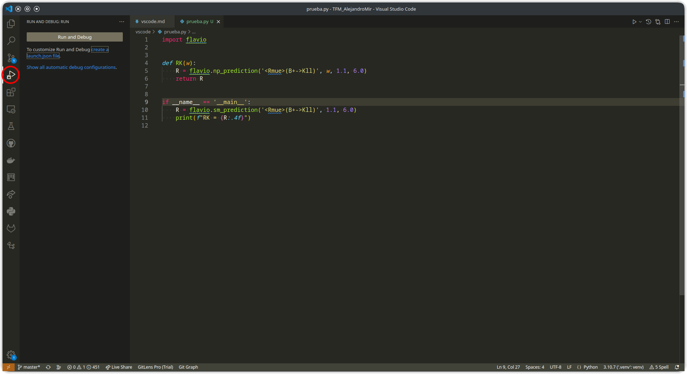
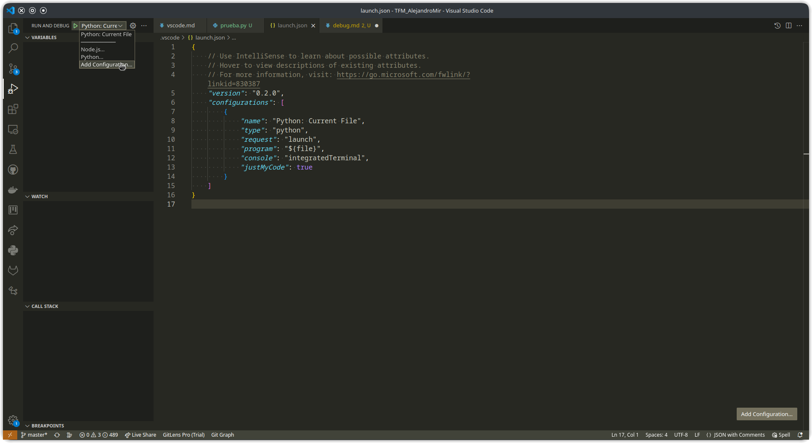
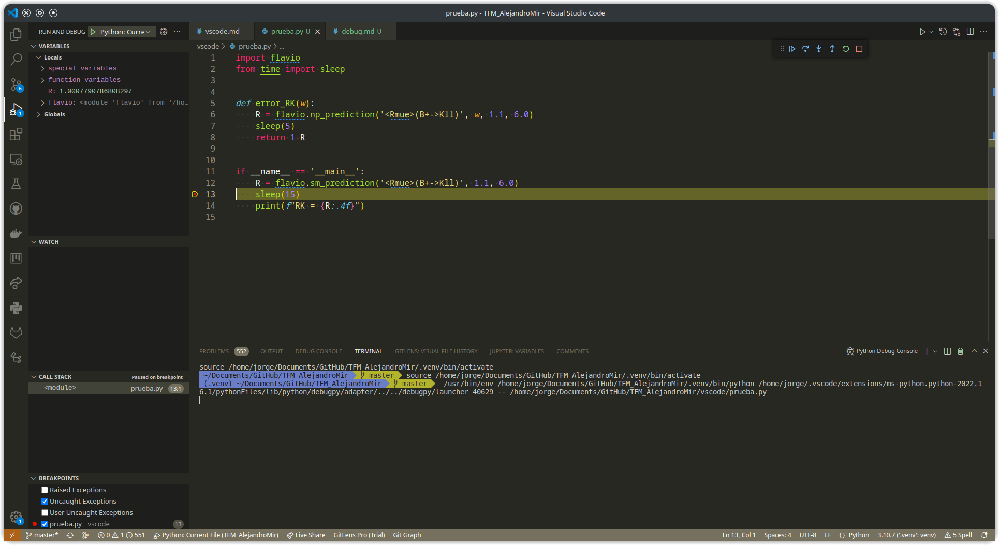
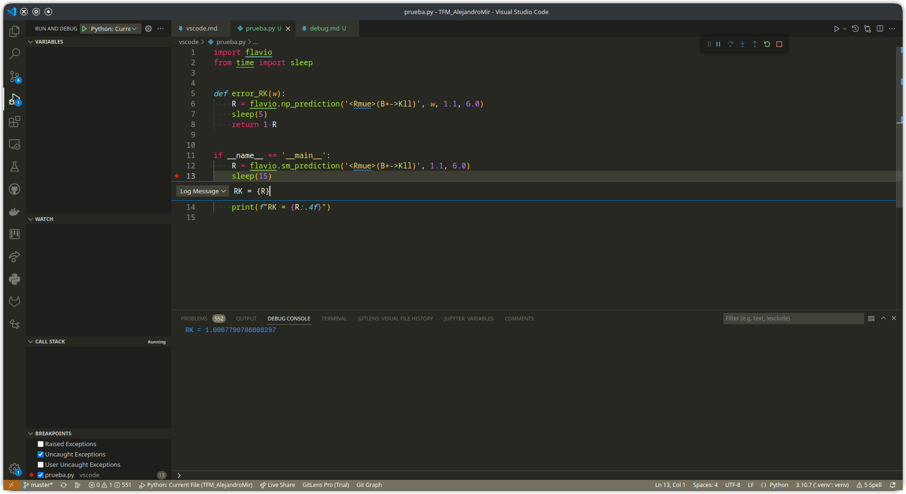
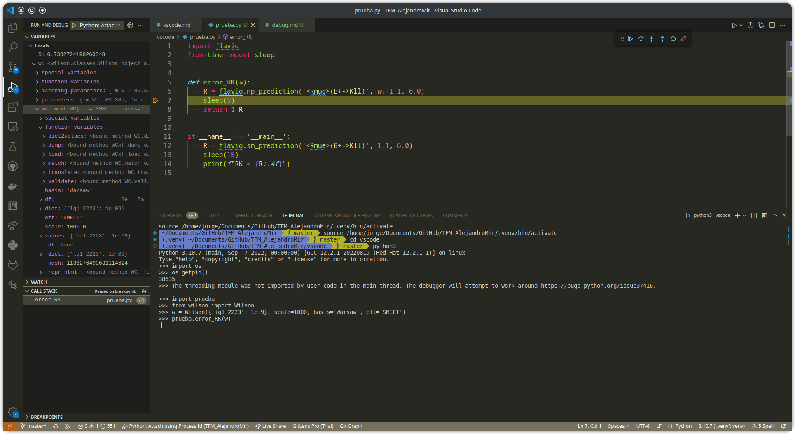
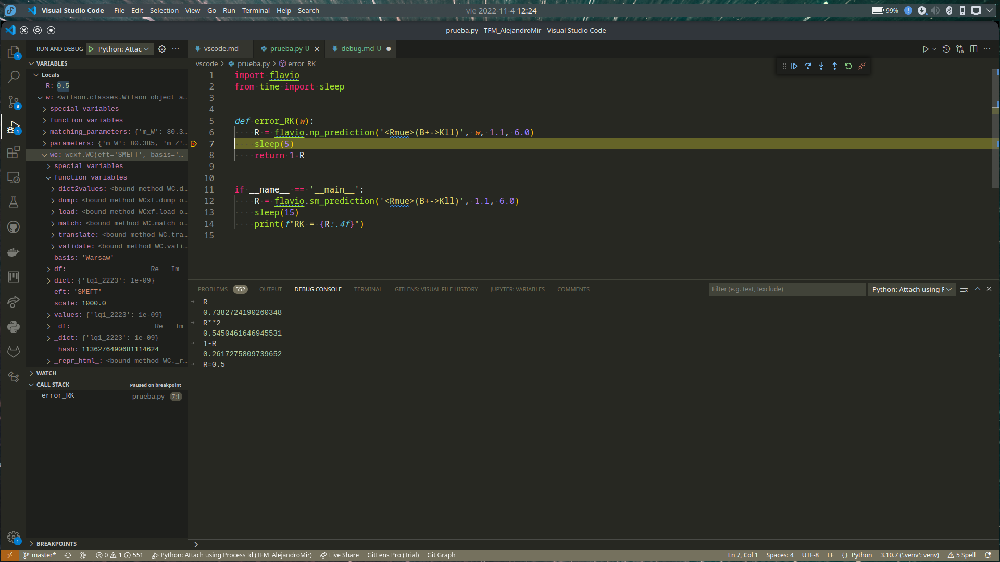
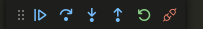

# Debug

VSCode permite realizar el debug de archivos de Python. Para empezar, abre el panel lateral de Debug



En primer lugar hay que configurar el debugger. Para ello, selecciona "Crear un archivo launch.json". Aparecerán varias opciones, de ellas nos van a interesar dos:

* **Archivo de Python:** Para archivos que se ejecutan con el botón Run.
* **Unirse usando una ID de proceso:** Para sesiones interactivas de Python.

Vamos a crear los dos tipos de configuraciones. Primero selecciona la configuración para archivos, esto abrirá `launch.json` con la configuración predeterminada. Para añadir el debugger interactivo, tienes que abrir el desplegable que hay en la parte superior del panel de Debug, y seleccionar Añadir configuración.



Selecciona Python, y la configuración para unirse con la ID de proceso. Se habrá añadido más texto al archivo `launch.json`. De las configuraciones que puedes modificar, en algunos casos puede ser interesante cambiar `justMyCode` a `false`, de esta forma puedes hacer debug de los módulos que importas (por ejemplo, si quieres ver paso a paso cómo flavio calcula un observables). Guarda el archivo `launch.json`.

## Abriendo el debugger

Para usar el debugger con un archivo de python, simplemente selecciona "Python: Current File" en el desplegable del panel de Debug y pulsa F5.

Para usar el debugger en una sesión interactiva, en python ejecuta el siguiente código:

```python
import os
os.getpid()
```

Esta función devuelve la ID del proceso de Python en el que estás trabajando. A continuación, en el desplegable del panel de Debug selecciona "Attach using process ID". Pulsa F5, y saldrá una lista con todos los procesos en ejecución a los que puedes unir el debugger, selecciona aquel cuyo ID coincide con el del proceso actual.

## Breakpoints

Un breakpoint detiene temporalmente la ejecución del código al llegar a una línea. Para crear un breakpoint, pulsa en el espacio que hay a la izquierda del número de línea. Aparecerá un círculo rojo, y en el panel de Debug, en la sección de Breakpoints (abajo), el nombre del archivo donde has creado el breakpoint, y a su derecha el número de línea. Cuando la ejecución del código llegue a esa línea, se parará y la línea estará resaltada en amarillo.



Es posible crear breakpoints condicionales. Para ello, crea un breakpoint normal, y pulsa el círculo rojo con el botón derecho para editarlo. Hay tres tipos de condiciones:

* Expresión: Solamente se detiene la ejecución si se cumple una condición booleana, por ejemplo `R > 1.0`. El icono cambia a un círculo rojo con un signo =.
* Hit count: Solamente se detiene la ejecución las primeras `n` veces que se alcanza esta línea. Por ejemplo, si estás dentro de un bucle y solamente quieres detener en la primera ejecución.
* Logpoint: En este caso nunca se detiene la ejecución. Al llegar a la línea, imprime por la consola de Debug la expresión introducida. La consola de Debug es distinta al terminal en el que se ejecuta Python, la puedes abrir con Ctrl+Shift+Y, o seleccionando la pestaña en el panel inferior. La expresión de debug funciona como una `f-string`, puedes usar variables y expresiones poniéndolas entre {}. En un logpoint, el icono cambia a un diamante rojo.



## Mientras la ejecución está detenida



En la parte superior del panel de Debug, puedes ver las variables locales y gloables a las que Python tiene acceso, y sus valores. Para las variables de tipos sencillos (`int`, `float`, `str`, etc) se ve simplemente su valor. Para tipos más complejos, como listas, diccionarios, o tipos definidos por clases, se pueden ver sus componentes como desplegables.

En la parte media del panel de Debug está la lista de llamadas. Allí puedes ver qué función ha llamado a esta línea de código, y la función que ha llamado a esta función, y así sucesivamente. Pulsando sobre el nombre de la función te lleva a su código.

En la consola de debug puedes ejecutar código de Python de forma interactiva, accediendo a variables, operando con ellas e incluso modificando su valor para cuando se reanude la ejecución.



Durante el breakpoint aparece una barra de herramientas flotante, inicialmente arriba a la derecha, para controlar la ejecución del programa:



* El primer botón, Continuar, reanuda la ejecución hasta el próximo breakpoint, o hasta que acabe el programa.
* El segundo botón va a la siguiente línea de código en el mismo nivel de la lista de llamadas, y vuelve a detener la ejecución.
* El tercer botón va, si es posible, a la siguiente línea en un nivel más profundo de la lista de llamadas, (es decir, entra dentro de una función) y vuelve a detener la ejecución.
* El cuarto botón va a la siguiente línea en un nivel menos profundo de la lista de llamadas, y vuelve a detener la ejecución.
* El último botón desconecta el debugger. El programa se seguirá ejecutando normalmente hasta que acabe.
