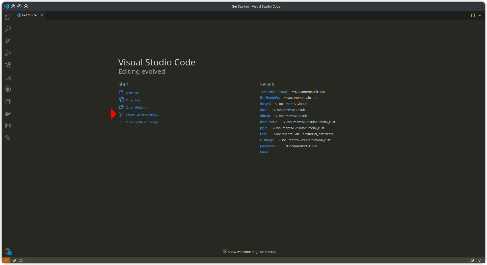
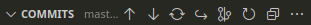
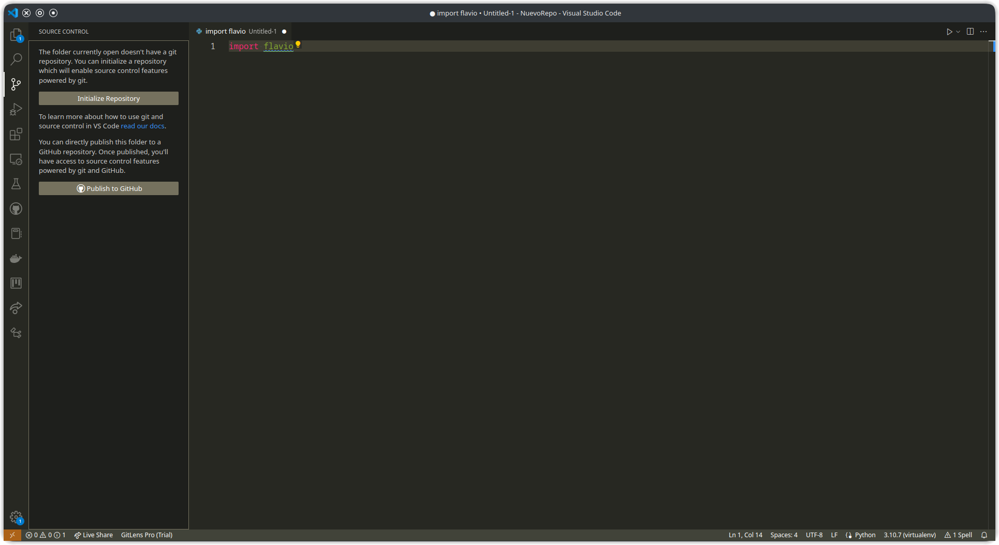
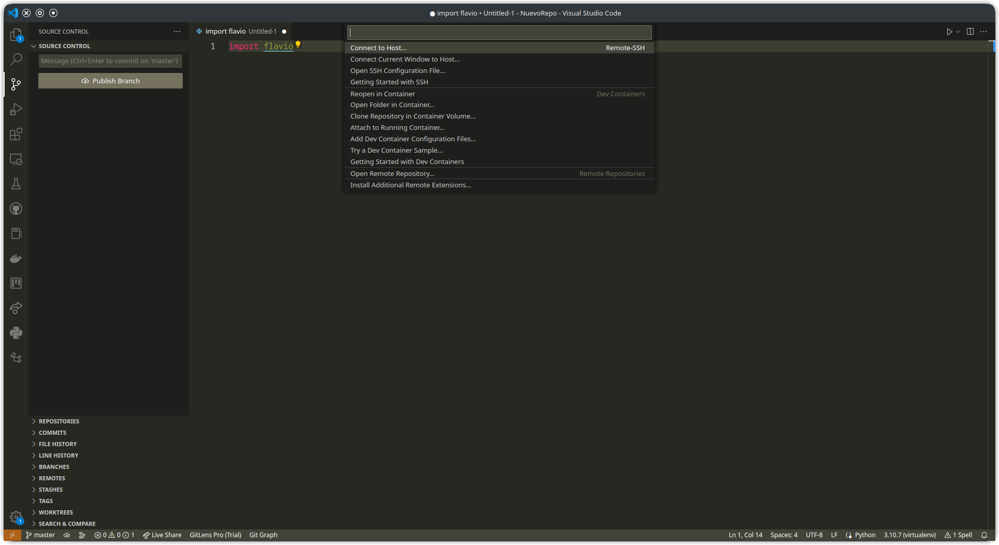
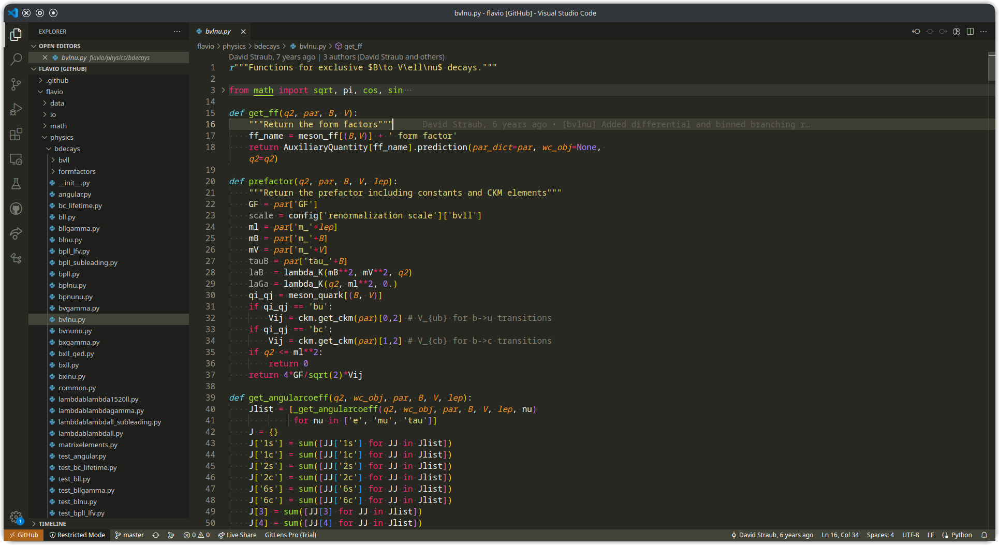

# Usando GitHub desde VSCode

Empezamos clonando este repositorio. Para ello, pulsa clonar en la pantalla de inicio, o Ctrl+Shift+P y escribe `Git clone`.

Escribe la dirección del repositorio de GitHub,

Al ser un repositorio privado, si no no has usado nunca GitHub desde VSCode, te redirigirá a la página de login para comprobar que tienes acceso.

Cuando esté listo, copiará todos los archivos e iniciará el repositorio git local en tu ordenador.

En la parte inferior izquierda de la ventana puedes ver el nombre de la rama actual, en este caso `master`. El asterisco indica que hay archivos cambiados desde el último commit sin añadir a la fase de stage, y el signo + indica que hay archivos cambiados que sí se han añadido a la fase de stage. Si pulsas en el nombre de la rama, puedes cambiar de rama o crear nuevas.

Pulsando en el botón rodeado, se abre el panel de control de cambios.

En el apartado desplegable de Control de Cambios verás los archivos modificados que están en la fase de stage y los que no están (los archivos listados en `.gitignore` no aparecerán aquí). Para añadir un archivo a la fase de stage, pulsa el signo + que aparece al pasar el cursor por encima, y para retirarlo de la fase de stage, pulsa el signo -. A la izquierda de los archivos, aparecen unas letras:

* **U:** *Untracked*. El archivo no ha sido incluído todavía en el registro de cambios de git.
* **A:** *Added*. El archivo se va a añadir al registro de cambios de git.
* **M:** *Modified*. El archivo tiene cambios con respecto a la última versión.
* **R:** *Renamed*. Se va a cambiar el nombre del archivo.
* **D:** *Deleted*. Se va a eliminar el archivo.

Cuando tengas todos los cambios listos en la fase de stage, escribe el mensaje del commit y pulsa el botón con el tick. Esto crea un commit en tu repositorio local, pero todavía no lo ha sincronizado con el repositorio origen (GitHub).

En el desplegable de Commits, puedes ver qué archivos se han creado, modificado o eliminado en cada commit, así como el autor y la fecha. En la parte superior hay varios botones con forma de flecha:

* El tercer botón, con dos flechas en forma de círculo, es "Fetch": Obtiene del repositorio origen la información sobre posibles nuevos commits, nuevas ramas, etc.
* El segundo botón, con una flecha hacia abajo, es "Pull": Aplica en tu repositorio local los cambios que se han realizado en el repositorio remoto.
* El primer botón, con una flecha hacia arriba, es "Push": Sube tus commits locales al repositorio origen. Para evitar posibles conflictos de edición, es preferible usar el orden Fetch -> Pull -> Push.
* El quinto botón, con forma de árbol abstracto(?), abre el gráfico de commits (esta función no está disponible para repositorios privados). En proyectos complejos con múltiples ramas, permite ver cuándo se separan y se vuelven a juntar cada una de ellas:

## Crear nuevo repositorio

Para crear un repositorio desde cero usando VSCode, primero crea una carpeta nueva y ábrela. Al activar el panel de Control de Cambios, verás lo siguiente:

Pulsa para iniciar el repositorio. Ahora podrás hacer commits en el repositorio local. Cuando estés listo para crear el repositorio remoto en GitHub, simplemente pulsa el botón de publicar. Podrás elegir el nombre del repositorio origen, y si es público y privado:

## Comparar cambios

Si tienes algún archivo modificado respecto al último commit, puedes ver los cambios realizados haviendo doble clic en el nombre del archivo en el panel de control de cambios:

La ventana se divide en dos: en la mitad izquierda está la versión antigua, y en la mitad derecha la versión nueva. Los archivos se comparan línea a línea (y en el caso de los cuadernos de Jupyter, también se comparan los resultados de cada celda). Una línea añadida aparecerá resaltada en verde en la mitad derecha, una línea eliminada aparecerá en rojo en la mitad izquierda, y una línea modificada aparecerá en rojo a la izquierda y en verde a la derecha.

También puedes ver los cambios que introdujo un commit en un archivo. Para ello, en el panel de Control de Cambios abre el desplegable de commits, selecciona el commit en concreto, y bajo él, el nombre del archivo que quieres comparar.

## Ver repositorios remotos

Es posible ver desde VSCode repositorios de GitHub sin tener que clonarlos. Para ello, primero pulsa en el botón "><" que hay en la esquina inferior izquierda de la pantalla. Verás el siguiente diálogo:

Selecciona la opción de Abrir Repositorio Remoto, y después Abrir Repositorio de GitHub. Introduce el nombre o dirección del repositorio que quieres abrir:

Una vez abierto, podrás examinar el repositorio como cualquier otra carpeta en VSCode. Algunas funciones y extensiones están desactivadas.

Alternativamente, puedes abrir un repositorio remoto de GitHub en cualquier ordenador, aunque no tenga VSCode instalado.Abre la página del repositorio en tu navegador web, y en la dirección cambia `github.com` por `github.dev`, o simplemente pulsa la tecla `.` del teclado, y se abrirá la versión web de VSCode.

Tanto la versión de VSCode como la versión web de un repositorio remoto permiten guardar los cambios localmente antes de sincronizar. Para sincronizar los cambios, usa el panel de cambios del mismo modo que en un repositorio normal. La única diferencia es que cada vez que se hace un commit, automáticamente se hace también un push.

## Codespaces

Un repositorio remoto tiene la desventaja de que algunas funciones están desactivadas, entre ellas la posibilidad de ejecutar el código (en la versión web). Codespaces permite superar estas limitaciones: se trata de un contenedor (es decir, un "mini sistema operativo", en este caso un Ubuntu 20.04 sin entorno gráfico) disponible "en la nube".

Para crear un codespace, abre la página de GitHub del repositorio y pulsa el botón verde "Code". En la segunda pestaña puedes ver si hay algún codespace ya creado para el proyecto, o crear uno nuevo. El contenedor se crea inicialmente con VSCode, python, el contenido del repositorio, y sus dependencias (si están especificadas en un archivo `requirements.txt`, de `poetry`, etc.). A continuación puedes abrir el codespace, ya sea en la versión web o en VSCode si lo tienes instalado en tu ordenador. En un proyecto colaborativo, todos los miembros tienen acceso a los mismos codespaces, así que es como si trabajaran en el mismo ordenador.

Nota: en las cuentas gratuitas de GitHub, solo hay disponibles 60h mensuales de Codespaces.
