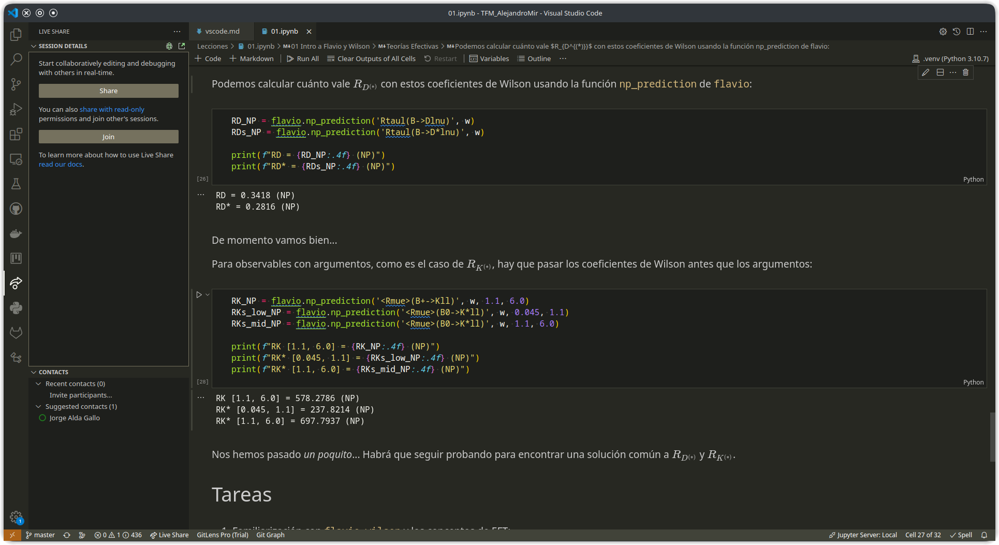
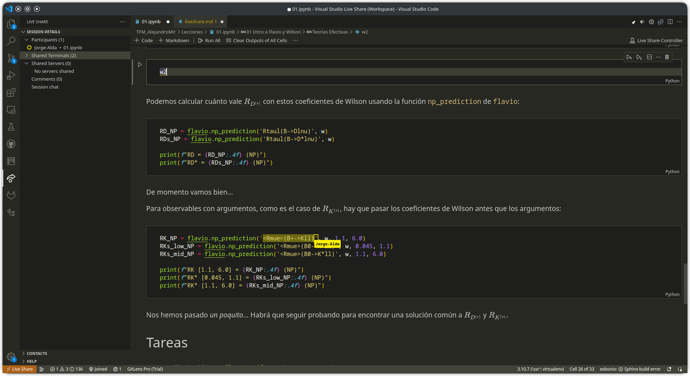
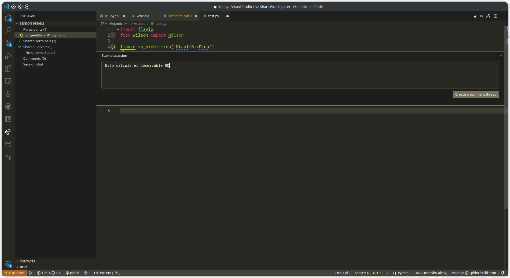

# Sesiones colaborativas

La extensión `Live Share` permite a varias personas trabajar de forma simultánea en un mismo archivo. Para iniciar una sesión colaborativa, abre el panel lateral de Live Share y pulsa Compartir:

Esto crea un enlace a la sesión, que se copia automáticamente al portapapeles. Para unirse a una sesión, pulsa Unirse en el panel de Live Share, e introduce el enlace a la sesión. El creador de la sesión puede además comenzar una llamada de audio, a la que el resto de participantes pueden unirse.

En el panel lateral, puedes ver la lista de participantes. Cada uno tiene a su lado una circunferencia de un color. La posición del cursor de cada participante está marcada con ese mismo color. Pulsando sobre el nombre de un participante, empiezas a seguirle. Eso significa que estás viendo lo mismo que tiene en pantalla. El participante a quien sigues está marcado con un círculo completamente coloreado en el panel lateral. Puedes forzar a que todos los participantes te sigan a ti, pulsando el botón con forma de megáfono en la parte superior del panel lateral.

Puedes comentar líneas de código en archivos de texto (no en cuadernos de Jupyter), pulsando en el icono + que aparece junto al número de línea. El resto de participantes pueden ver los comentarios y responder.

Para terminar la sesión colaborativa, pulsa el botón de Prohibido en la parte superior del panel lateral de Live Share.
