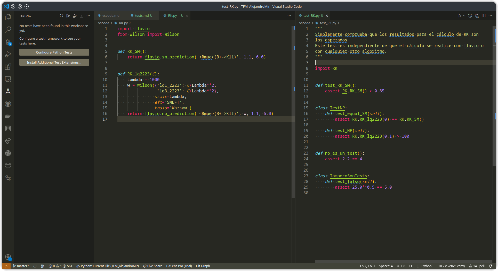
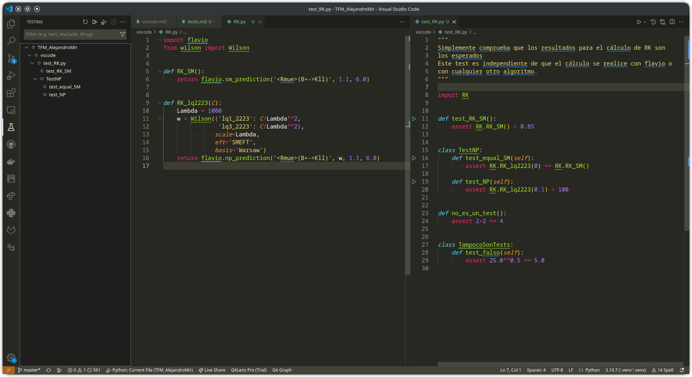
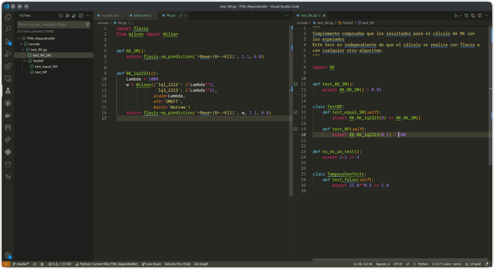
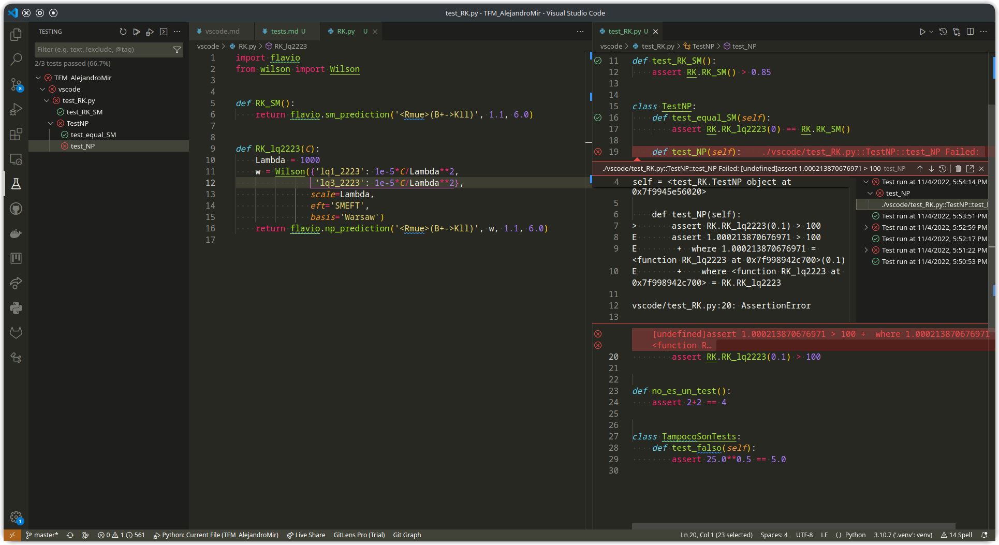

# Tests

Los tests permiten comprobar que tu código funciona como se supone que debe funcionar. Usan un enfoque de "caja negra", simplemente comparan el output de tus funciones dado un input, pero sin examinar los detalles internos. Esto es útil, por ejemplo, si estás modificando una función ya existente, para saber que las modificaciones no hayan hecho que deje de funcionar.

Una de las posibles estrategias para diseñar tests son los tests por unidades, en los que se definen varios tests, cada uno encargado de una pequeña sección de código. Hay varias herramientas para realizar tests por unidades en Python, la más sencilla es `pytest`.

## Definir tests

Los tests se deben almacenar en uno o varios archivos `.py`, en la misma carpeta que el código testeado, cuyo nombre debe empezar obligatoriamente por `test_`. En estos archivos, primero tienes que importar el código que vas a testear.

Cada test se define como una función, cuyo nombre también debe empezar por `test_`. Estas funciones, en vez de `return` usan una cláusula `assert`, seguida de una expresión booleana. Si la expresión del `assert` es verdadera, el test se supera, y si es falsa, el test se falla. Se pueden agrupar varios tests dentro de una clase, cuyo nombre debe empezar por `Test` (la primera en mayúscula).

## Ejecutar los tests

Abre el panel lateral de tests (icono de un matraz) y selecciona Configurar tests. Te dará a elegir entre `unitests` y `pytest`, elige `pytest`, y si no está disponible en el entorno virtual actual, lo instalará. A continuación te pedirá que selecciones la ubicación de los tests, selecciona `.` (raíz del proyecto).

Tras unos segundos, aparecerán en el panel lateral todos los tests disponibles. Fíjate que las funciones que no siguen las reglas para los nombres de test no aparecen. Desde el panel lateral, puedes lanzar los tests de manera individual o por grupos (directorio, archivo, clase). También puedes lanzar los tests individuales dando al botón verde que aparece en el margen del archivo donde están definidos.

Si todos los tests han sido superados, verás un tick verde en el panel lateral y en el margen junto a su definición.

Por el contrario, si modificamos el código y uno de los tests falla, aparecerá una cruz roja en el tests fallido y en todos los grupos que lo contienen. Además, bajo el código del test vemos la razón por la que ha fallado, en este caso porque 1.000213870676971 no es mayor que 100.
