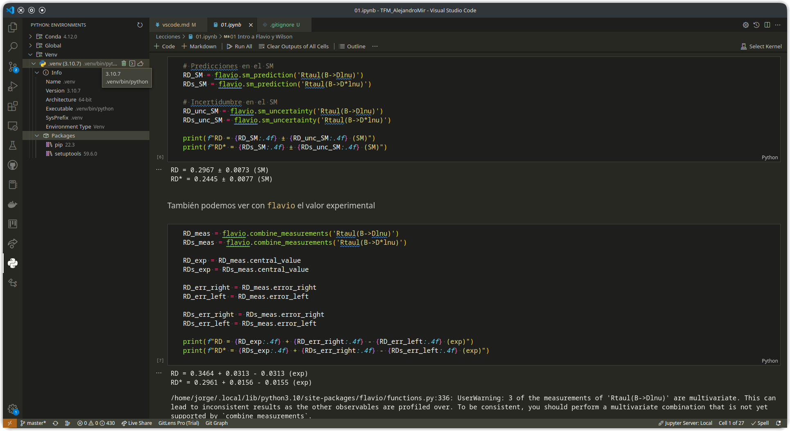
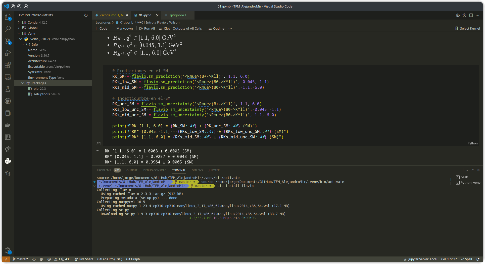
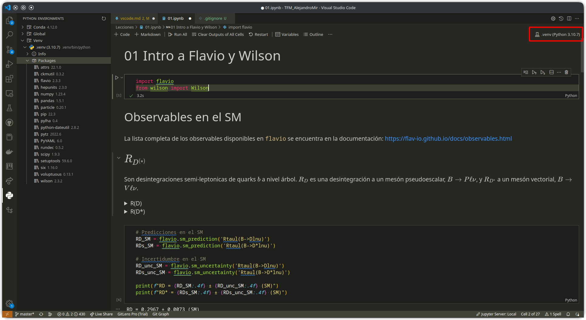
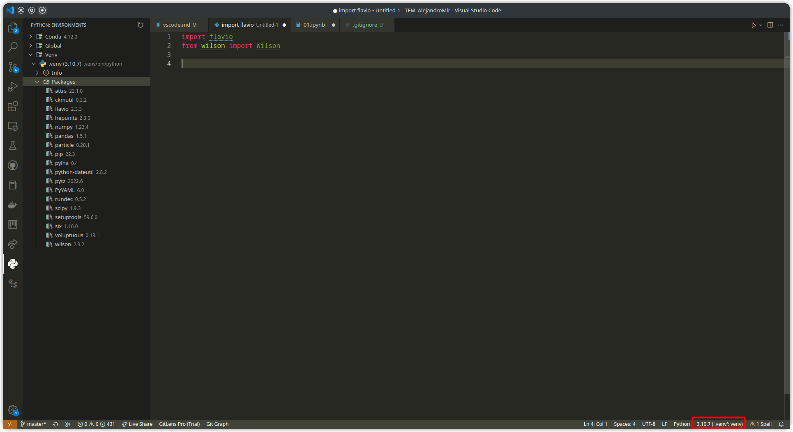

# Virtual Environments

Para crear un entorno virtual de Python desde VSCode, pulsa Ctrl+Shift+P y escribe `Python: Create Environment` (es suficiente con empezar a escribir "env"). Podrás elegir entre un entorno de venv, y uno de conda. Flavio no está disponible en conda, así que selecciona venv. A continuación, te preguntará que versión de Python quieres usar, selecciona la opción por defecto.

Esto crea una carpeta llamada `.venv` con los archivos necesarios. Para evitar que GitHub quiera sincronizar estos archivos, crea o modifica un archivo con nombre `.gitignore` en el directorio principal, y añade la línea `.venv`.

Ahora el entorno está creado, pero aún no activado. Si has instalado la extensión `Python Environment Manager`, tendrás un panel lateral con el logo de Python. Al abrirlo, verás todas las versiones de Python y entornos disponibles. En el apartado Venv está el entorno que acabamos de crear:



Junto al nombre del entorno hay tres botones. El segundo abre un terminal con el entorno abierto, y el tercero selecciona este entorno para usarlo en el proyecto actual. En la información del entorno puedes ver que inicialmente solo hay dos paquetes instalados, `pip` y `setuptools`. Abre el terminal con el segundo botón, e instala flavio con el comando

```pip install flavio```



Para usar un cuaderno de Jupyter, primero tienes que instalar

```pip install ipykernel```

y después crear un kernel de Jupyter con el comando

```ipython kernel install --user --name=venv```

Cuando abras un cuaderno de Jupyer, asegúrate de que estés usando el kernel adecuado. Para ello, mira a la esquina superior derecha y comprueba que pone `.venv` (si has usado el botón para seleccionar el entorno del proyecto actual, ya lo tendrás listo). Si el kernel activo no se corresponde con el entorno, pulsa sobre el nombre del kernel y busca .venv.



Cuando estés editando un archivo `.py`, verás el entorno activo en la esquina inferior derecha. De nuevo, pulsando sobre el nombre, puedes cambiar el entorno o la versión de Python.


