# Usando VSCode

## Extensiones recomendadas

### Python

* [Python](https://marketplace.visualstudio.com/items?itemName=ms-python.python)
* [Jupyter](https://marketplace.visualstudio.com/items?itemName=ms-toolsai.jupyter)
* [autoDocstring - Python](https://marketplace.visualstudio.com/items?itemName=njpwerner.autodocstring)
* [Python Environment Manager](https://marketplace.visualstudio.com/items?itemName=donjayamanne.python-environment-manager)

### GitHub

* [GitHub Pull Requests and Issues](https://marketplace.visualstudio.com/items?itemName=GitHub.vscode-pull-request-github)
* [GitHub Repositories](https://marketplace.visualstudio.com/items?itemName=GitHub.remotehub)
* [GitLens](https://marketplace.visualstudio.com/items?itemName=eamodio.gitlens)

### Otros

* [H5Web](https://marketplace.visualstudio.com/items?itemName=h5web.vscode-h5web)
* [Live Share](https://marketplace.visualstudio.com/items?itemName=MS-vsliveshare.vsliveshare-pack)

## Usando GitHub desde VSCode

Empezamos clonando este repositorio. Para ello, pulsa clonar en la pantalla de inicio, o Ctrl+Shift+P y escribe `Git clone`.

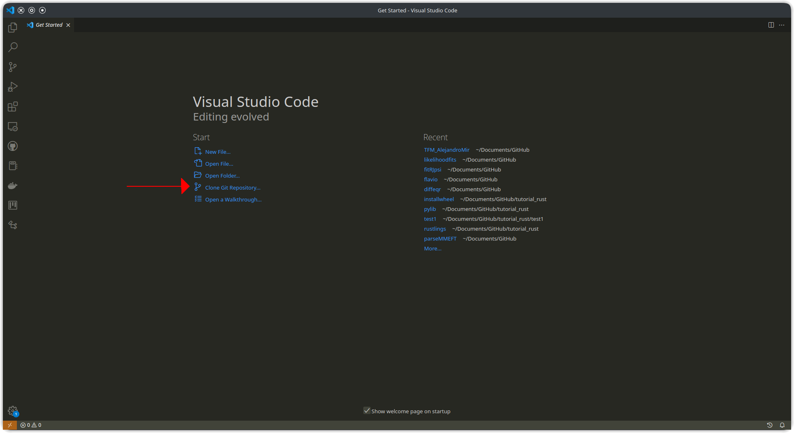

Escribe la dirección del repositorio de GitHub,

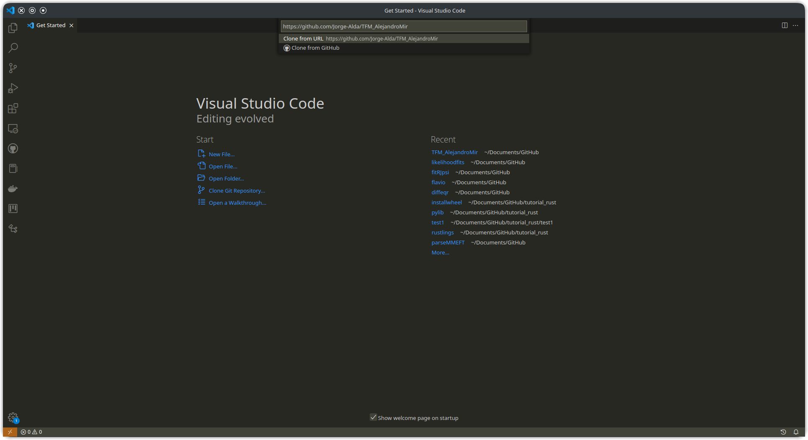

Al ser un repositorio privado, si no no has usado nunca GitHub desde VSCode, te redirigirá a la página de login para comprobar que tienes acceso.

Cuando esté listo, copiará todos los archivos e iniciará el repositorio git local en tu ordenador.

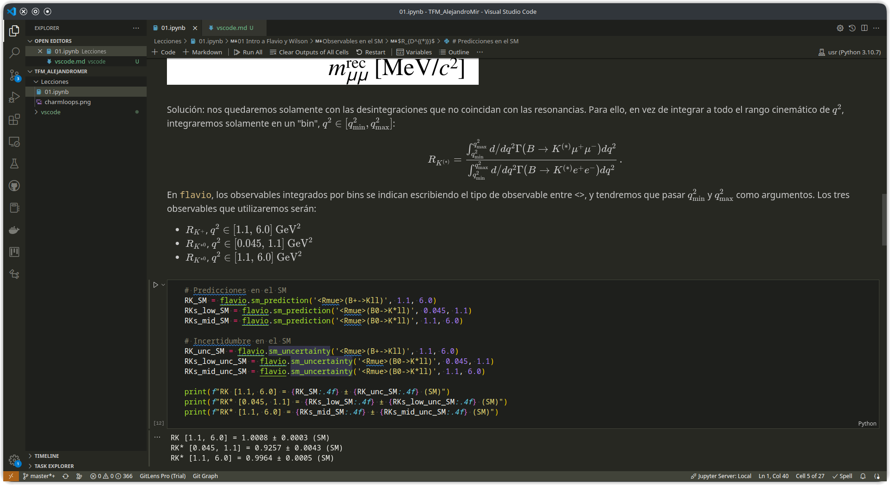

En la parte inferior izquierda de la ventana puedes ver el nombre de la rama actual, en este caso `master`. El asterisco indica que hay archivos cambiados desde el último commit sin añadir a la fase de stage, y el signo + indica que hay archivos cambiados que sí se han añadido a la fase de stage. Si pulsas en el nombre de la rama, puedes cambiar de rama o crear nuevas.

Pulsando en el botón rodeado, se abre el panel de control de cambios.

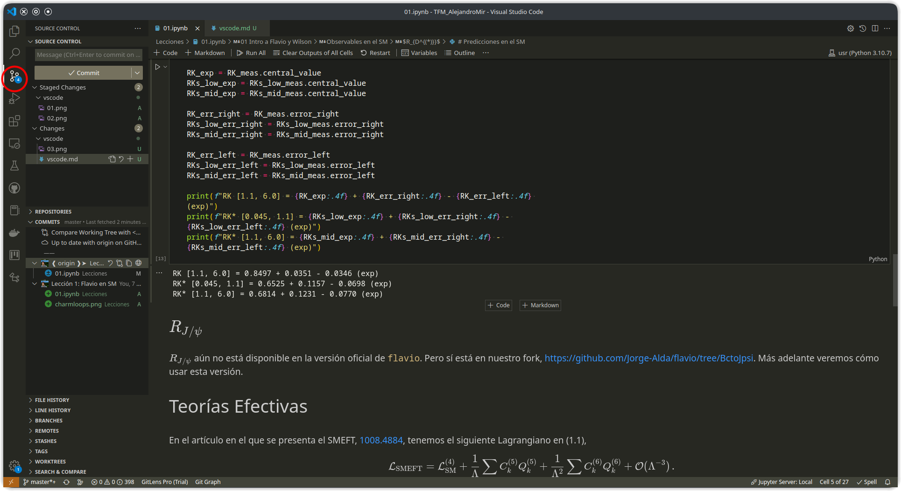

En el apartado desplegable de Control de Cambios verás los archivos modificados que están en la fase de stage y los que no están (los archivos listados en `.gitignore` no aparecerán aquí). Para añadir un archivo a la fase de stage, pulsa el signo + que aparece al pasar el cursor por encima, y para retirarlo de la fase de stage, pulsa el signo -. Cuando tengas todos los cambios listos en la fase de stage, escribe el mensaje del commit y pulsa el botón con el tick. Esto crea un commit en tu repositorio local, pero todavía no lo ha sincronizado con el repositorio remoto (GitHub).

En el desplegable de Commits, puedes ver qué archivos se han creado, modificado o eliminado en cada commit, así como el autor y la fecha. En la parte superior hay varios botones con forma de flecha:

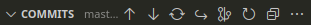

* El tercer botón, con dos flechas en forma de círculo, es "Fetch": Obtiene del repositorio remoto la información sobre posibles nuevos commits, nuevas ramas, etc.
* El segundo botón, con una flecha hacia abajo, es "Pull": Aplica en tu repositorio local los cambios que se han realizado en el repositorio remoto.
* El primer botón, con una flecha hacia arriba, es "Push": Sube tus commits locales al repositorio remoto. Para evitar posibles conflictos de edición, es preferible usar el orden Fetch -> Pull -> Push.
* El quinto botón, con forma de árbol abstracto(?), abre el gráfico de commits (esta función no está disponible para repositorios privados). En proyectos complejos con múltiples ramas, permite ver cuándo se separan y se vuelven a juntar cada una de ellas:

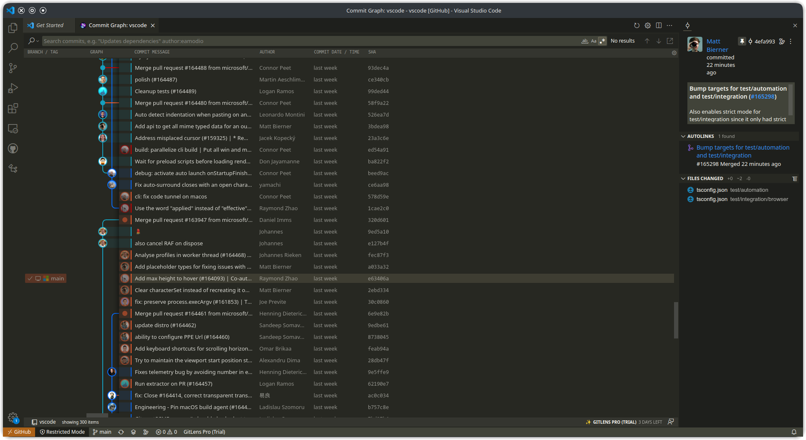

### Crear nuevo repositorio

Para crear un repositorio desde cero usando VSCode, primero crea una carpeta nueva y ábrela. Al activar el panel de Control de Cambios, verás lo siguiente:

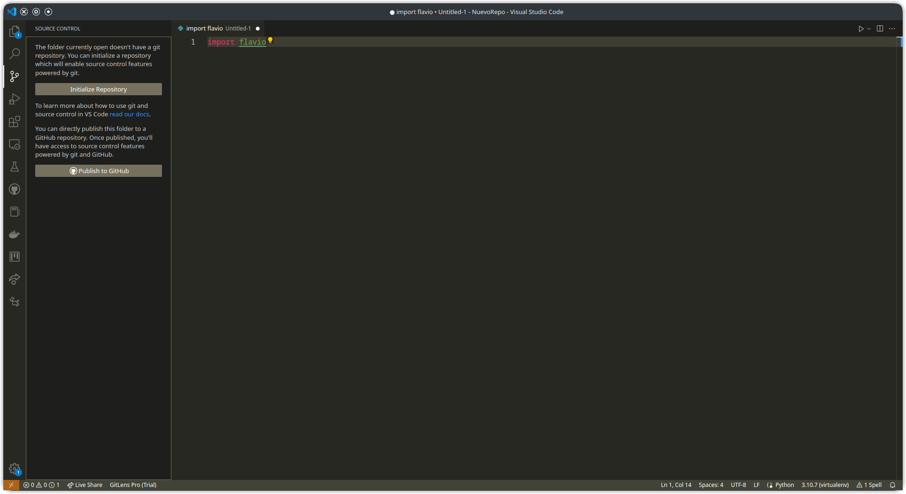

Pulsa para iniciar el repositorio. Ahora podrás hacer commits en el repositorio local. Cuando estés listo para crear el repositorio remoto en GitHub, simplemente pulsa el botón de publicar. Podrás elegir el nombre del repositorio remoto, y si es público y privado:

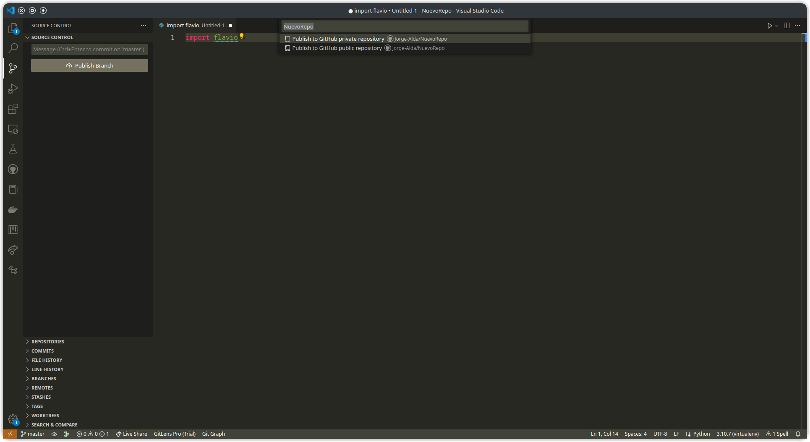

### Ver repositorios remotos

Es posible ver desde VSCode repositorios de GitHub sin tener que clonarlos. Para ello, primero pulsa en el botón "><" que hay en la esquina inferior izquierda de la pantalla. Verás el siguiente diálogo:

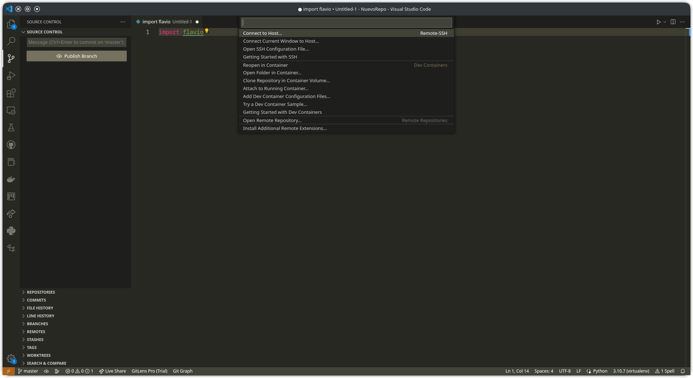

Selecciona la opción de Abrir Repositorio Remoto, y después Abrir Repositorio de GitHub. Introduce el nombre o dirección del repositorio que quieres abrir:

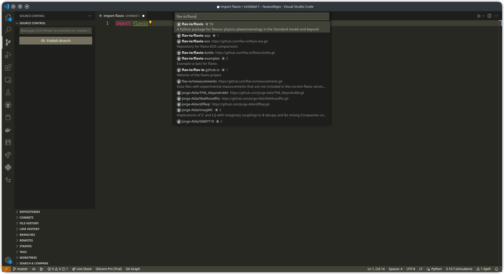

Una vez abierto, podrás examinar el repositorio como cualquier otra carpeta en VSCode. Algunas funciones y extensiones están desactivadas.

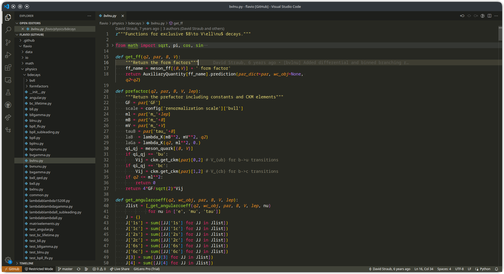
